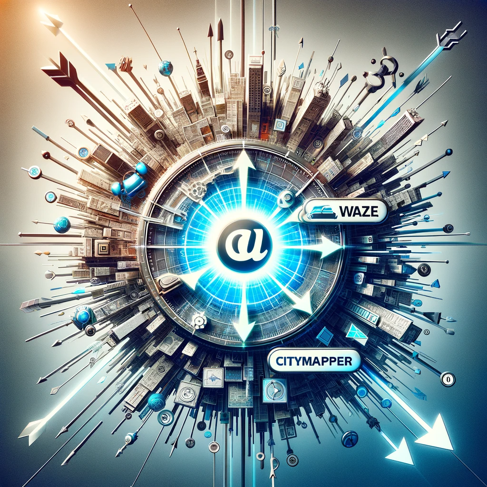

# PEC3_Manovich_Reloaded

# **La Hibridacion en los medios**.

## Como entender la hibridacion.

Podemos resumir de forma breve lo que en mi parecer Manovich quiere decirnos sobre la hibridacion en los medio de esta forma.

1. **Convergencia Mediática:**
   Manovich destaca cómo el software permite la convergencia de diferentes medios, como texto, imagen, video y sonido, en plataformas y formatos digitales unificados. Esto lleva a la creación de experiencias mediáticas ricas y multidimensionales.

2. **Nuevas Formas de Narrativa:**
   La hibridación a través del software abre nuevas posibilidades para la narrativa y el arte, permitiendo a los creadores mezclar y combinar diferentes géneros y formatos para contar historias de maneras innovadoras.

3. **Cultura del Remix:**
   Manovich a menudo se refiere a la cultura del "remix", donde el software facilita la reutilización y combinación de contenidos existentes para crear nuevas obras, lo que refleja un cambio en la forma en que entendemos la autoría y la creatividad.

4. **Interactividad y Participación del Usuario:**
   El software también permite una mayor interactividad y participación del usuario, lo que significa que la experiencia de los medios ya no es unidireccional, sino que se convierte en un diálogo entre el creador y el consumidor.

5. **Personalización y Datos:**
   Finalmente, Manovich discute cómo el software permite una personalización avanzada de experiencias mediáticas, utilizando algoritmos y análisis de datos para adaptar el contenido a las preferencias individuales de los usuarios.

# **Medios hibridados** 
## Waze y CityMaper

Con estos dos ejemplos vamos a tratar de exponer que es la hibridacion y como la ve Manovich.

# Waze

Esta aplicación se ha convertido en una indispensable en muchos de los móviles en la actualidad. Se nutre de la información que van dando sus mismos usuarios y de ahí viene su grandeza.

Podemos ver entonces como la hibridación de medios es palpable en ella. Para empezar vamos a desarrollar cada parte de la que consta.

- ## Geolocalización y Mapas interactivos

Utiliza el GPS para obtener la geolocalización en tiempo real del usuario y la muestra en mapas interactivos que se van actualizando también en tiempo real. Proporciona una representación visual dinámica y precisa del entorno vial. Esta innovación no solo facilita la orientación y el tránsito, sino que también enriquece la experiencia del usuario, permitiendo una interacción directa con el mapa.

Los usuarios pueden visualizar su ruta actual, explorar diferentes caminos y obtener una comprensión intuitiva del entorno, todo esto gracias a una interfaz de usuario clara y accesible. Esta característica de Waze no solo mejora la eficiencia de la navegación, sino que también fomenta una mayor autonomía y seguridad en el viaje.

En mi caso, lo llevo siempre conectado con Android Auto al coche, le proporciono la dirección cercana a mi casa, cosa mías con la privacidad de datos, y siempre me aseguro de que voy a ir por el camino más rápido. Es capaz, por su forma de trabajar, de solventar atascos en tiempo real y darte una ruta más rápida a tu destino.

- ## Trafico en tiempo real

La característica de información de tráfico en tiempo real de Waze representa una fusión innovadora de tecnología y colaboración comunitaria. Al recopilar y analizar datos enviados por sus usuarios, Waze proporciona actualizaciones instantaneas sobre condiciones de tráfico, como congestiones, accidentes y obras viales. Esta funcionalidad transforma la experiencia de conduccion, permitiendo a los usuarios evitar demoras inesperadas y encontrar rutas más eficientes.

La capacidad de Waze para integrar información en tiempo real no solo mejora la planificación del viaje, sino que también fomenta una comunidad activa y cooperativa, donde cada usuario contribuye al bienestar colectivo en la carretera.

- ## Integración de Redes Sociales en Waze

Waze integra las redes sociales en su plataforma, creando una experiencia de navegación más conectada y social. Esta función permite a los usuarios compartir sus viajes y tiempos estimados de llegada con amigos o en plataformas sociales. Esta interconexión trasciende la simple navegación, convirtiendo a Waze en una herramienta social que conecta a las personas en sus viajes diarios. La capacidad de compartir información de viaje no solo fomenta la comunicación entre amigos y familiares, sino que también puede ser crucial en situaciones de emergencia. Esta hibridación social enriquece la experiencia de usuario, proporcionando un valor añadido que va más allá de la funcionalidad básica de navegación.

- ## Personalización y Gamificación en Waze

La gamificación y personalización en Waze representan un avance significativo en la interacción usuario-aplicación. Los usuarios son incentivados a reportar incidentes y condiciones de tráfico, ganando puntos y logros, lo que fomenta una participación activa y constante. Esta mecánica de juego no solo hace que la experiencia de navegación sea más atractiva, sino que también mejora la calidad y cantidad de datos recolectados, beneficiando

# CityMaper

- ## Integración Multimodal de Transporte en Citymapper

Citymapper sobresale en integrar múltiples modos de transporte público y privado en una sola aplicación. Esta convergencia de información abarca desde autobuses y trenes hasta bicicletas y vehículos compartidos, ofreciendo al usuario un abanico de opciones para planificar su viaje. La habilidad de Citymapper para amalgamar y procesar datos de diversas fuentes transforma la planificación de viajes urbanos, facilitando a los usuarios encontrar rutas eficientes y personalizadas. Esta integración multimodal es un claro ejemplo de hibridación de medios, donde la información de diversas plataformas se une para mejorar la experiencia del usuario en la movilidad urbana.

- ## Información en Tiempo Real en Citymapper

Citymapper se distingue por proporcionar información actualizada en tiempo real sobre el estado de los diferentes medios de transporte. Esta característica permite a los usuarios ajustar sus planes de viaje sobre la marcha, teniendo en cuenta retrasos, cancelaciones o cambios en el servicio. La aplicación recoge datos en vivo, asegurando que la información proporcionada sea lo más precisa y útil posible. La capacidad de Citymapper para ofrecer estos datos en tiempo real mejora significativamente la experiencia de viaje, permitiendo a los usuarios tomar decisiones informadas y eficientes.

- ## Interfaz Interactiva y Personalización en Citymapper

La interfaz de usuario de Citymapper es un ejemplo de diseño interactivo y personalizable. Los usuarios pueden ajustar la aplicación según sus preferencias de viaje, seleccionando modos de transporte favoritos o evitando ciertas rutas. La interfaz, clara y fácil de usar, combina mapas detallados, instrucciones paso a paso y símbolos intuitivos, lo que facilita la navegación y planificación de rutas. Esta personalización mejora la experiencia del usuario, haciendo que los viajes sean más cómodos y adaptados a las necesidades individuales.

- ## Conectividad y Compatibilidad en Citymapper

Citymapper muestra su hibridación de medios a través de su capacidad para integrarse con otras aplicaciones y servicios. Esto incluye la compatibilidad con calendarios para planificar viajes en función de eventos programados y la integración con servicios de transporte compartido. Esta conectividad ofrece una experiencia de usuario más holística y coherente, donde diferentes aspectos de la vida diaria y las tecnologías se unen de manera eficiente y útil.

He destacado los aspectos más importantes y relevantes de cada aplicación y creo que de esta forma se ve claramente que es la hibridación y como se da en estas dos apps.
Por ejemplo, en **Waze**. No solo es un mapa de calles y carreteras, es una red social de conductores, es un mundo interactivo y cambiante que te permite no solo llegar a tu destino, sino que lo haces de la forma mas eficiente y evitando cualquier obstáculo que te pudieras encontrar. Y aquí esta el ejemplo. 
Un mapa convencional te podría calcular la mejor ruta, pero no te sabe decir que en el PK 150 de la A2 sentido Madrid hay un “vehículo detenido en el arcén mas adelante”. Y no solo eso, te permite participar de este evento indicando si sigue o no ahí. Al margen de lo rico que es esto para los conductores, nos tenemos que fijar en como se han fusionado las aplicaciones de mensajería instantánea. Un usuario ha puesto un aviso y te a llegado a ti y al resto de usuarios de **Waze** que van por esa misma ruta; las aplicaciones de orientación y mapas GPS. El mapa se ha modificado en tiempo real y si es necesario calculara una nueva ruta.

